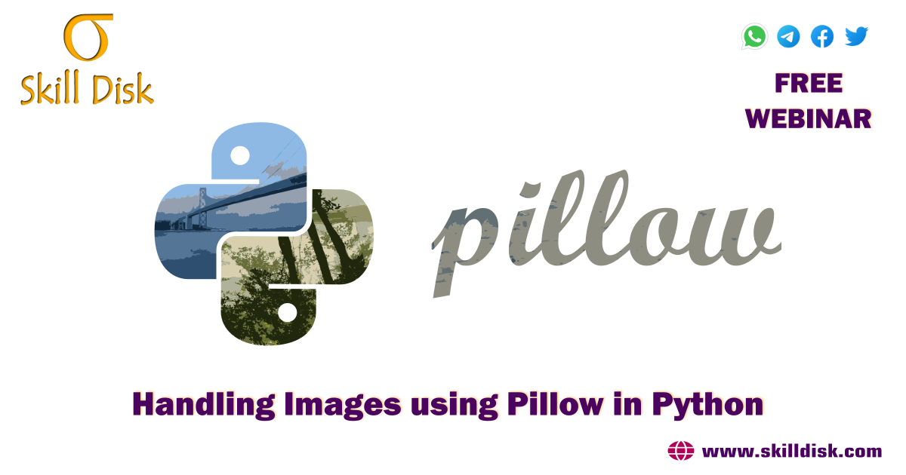

# Handling Images using Pillow in Python
Learn to create your own custom images and animations using python and improve your skills by enrolling to our free webinar.

#### 🙋‍♂️ Connect with us

<!-- Badges template - https://github.com/badges/shields -->

  
  
  
  

----